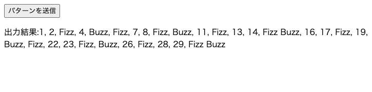

# 大問 1

本大問は Web サーバーにおける基本的な知識と簡単なアルゴリズムを問うコーディング演習である。  
以下の「問題」と「解答の提出」をよく読んで、解答してください。

## 問題

FizzBuzz の拡張として下記のようなパターンを API サーバーに POST します。送信されたパターンに応じて、入力を 1 から 30 としたときの出力をブラウザに表示する Web アプリケーションを完成させてください。

- データは必ず json 形式で渡されます。パターンのキーは必ず`"obj"`です。
- `"num"`キーは必ず小さい順にソートされています。

```json
{
  "obj": [
    { "num": 4, "text": "fizz" },
    { "num": 7, "text": "buzz" },
    { "num": 8, "text": "hoge" },
    { "num": 15, "text": "huga" }
  ]
}
```

### FizzBuzz とは

FizzBuzz というプログラムは、3 の倍数が入力されると”Fizz”を出力し、5 の倍数が入力されると”Buzz”を出力し、3 の倍数でも 5 の倍数でもある数が入力されると”FizzBuzz”を出力します。
3 の倍数でも 5 の倍数でもない数が入力されるとその数字をそのまま出力します。

## 入出力例

### 入力

```json
{
  "obj": [
    { "num": 3, "text": "Fizz" },
    { "num": 5, "text": "Buzz" }
  ]
}
```

### 出力

```
1, 2, Fizz, 4, Buzz, Fizz, 7, 8, Fizz, Buzz, 11, Fizz, 13, 14, Fizz Buzz, 16, 17, Fizz, 19, Buzz, Fizz, 22, 23, Fizz, Buzz, 26, Fizz, 28, 29, Fizz Buzz
```

#### Web アプリケーション完成イメージ

「パターンを送信」をクリックすると下図のように結果が表示されます。


## 回答準備

```bash
git clone git@gitlab.com:y0he1/avilen-web-codingtest.git
cd avilen-web-codingtest/Problem1
```

- PHP または node のどちらで回答するか選択し、`docker-compose.yaml`の中の php か node どちらかをコメントアウトする。
- `docker-compose up -d`とコマンドラインで実行し、二つのコンテナを立ち上げて実行する。
- http://localhost:3000 にアクセスしてサーバーが立ち上がっていることを確認
- http://localhost:8080 にアクセスしてサーバーが立ち上がっていることを確認

## 回答の始めかた

- `docker-compose down`でコンテナを止める。
- `./php/index.php`または`./node/index.js`を編集して回答をスタート。
- 回答終了後`docker-compose up -d`でコンテナを立ち上げて実行する。

## 回答終了後

- `docker-compose down`でコンテナを止める。
- `docker rmi $(docker images -a -q)`でイメージを削除。

## 解答の提出

- 回答のプログラムは php か node.js のどちらかの言語を利用して記述してください。
- php で回答する方は`php/index.php`を、node.js で回答される方は`node/index.js`を編集して提出してください。
- `index.html`は変更してはいけません。
